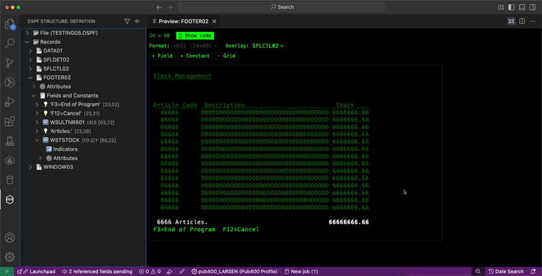

# DSPF-edit

**DSPF-edit** brings a live schema view, a drag-and-drop screen preview, and deep DDS keyword coverage to editing IBM i **display files** — right inside VS Code. No more counting columns in SEU, no more round-trips through STRSDA on a 5250 session, no more guessing how a `WINDOW`, an indicator condition, or a `CHOICE()` field will actually render until you compile.

---

## Why DSPF-edit?

| | SEU / STRSDA (5250) | RDi | DSPF-edit |
|---|:---:|:---:|:---:|
| Live visual preview while you edit | ❌ | ⚠️ separate tool/step | ✅ inline, drag to reposition |
| Auto-updating structure/schema view | ❌ | ✅ | ✅ |
| Runs inside VS Code | ❌ | ❌ (Eclipse) | ✅ |
| Simulate indicators/colors without compiling | ❌ | ❌ | ✅ |
| Multiple `DSPSIZ` formats (`*DS3`/`*DS4`) resolved side by side | ❌ | ⚠️ manual | ✅ |
| AND/OR indicator conditions (up to DDS's 9-indicator limit) built visually | ❌ | ⚠️ manual | ✅ |

DSPF-edit doesn't replace your compiler — it closes the gap between writing DDS and seeing the screen it produces, matching real **STRSDA** behavior field by field, so what you preview is what you get.

---

## ✨ Features

### 🖥️ Screen Preview — see it before you compile
  - Visual, green-screen-style preview of a record's fields and constants (colors, DSPATR attributes, and placeholders for output/input/both fields).
  - A field coded with `CNTFLD(n)` wraps across multiple lines in the preview, `n` characters each, all starting at its original column — matching how RDi previews it.
  - A single, compact toolbar (size, display format, overlay, indicators, add buttons) sits above the preview.
  - Drag fields/constants to reposition them directly on the preview.
  - "+ Field" / "+ Constant" buttons: click, then click a point on the screen to place a new field/constant there, using the same prompts as the tree's "Add field"/"Add constant" commands.
  - WINDOW records are drawn at their real screen position and can be resized/moved with the mouse; shows WDWTITLE if present. Supports windows shared via WINDOW(record-name).
  - Click a window's title to edit it, or use its "⋮" actions menu / one-click "center horizontally" icon — all shown only while hovering over the window.
  - Subfile (SFL/SFLCTL) records show all SFLPAG rows, and automatically preview their paired header/detail record; detail rows can't be dragged up over the header's own content.
  - Overlay any other record (dimmed) behind the one being previewed, to see how they compose.
  - Simulate indicators on/off to preview conditional fields, constants, and attributes.
  - A function-key legend (`F3`, `F12`, ...) shows every command key available to the record being previewed (file-level + record-level CAxx/CFxx); a key still shows even when its indicator condition isn't currently met (so you can see it's defined), switching to solid/inverted styling when it's actually active.
  - An active `ERRMSG()` on a window shows on the window's own reserved message line (its last content row) when the window doesn't specify `*NOMSGLIN`, matching real DDS behavior, instead of always at the bottom of the physical screen.
  - For files with more than one DSPSIZ format (e.g. *DS3/*DS4), switch which one is previewed — window positions/sizes and conditioned elements are resolved for the selected format. Dragging/resizing/centering a window, or adjusting a subfile's SFLPAG/SFLSIZ, only affects the size currently being previewed.
  - The "Indicators" toggle and the selected display format persist when switching which record is previewed in the same panel.
  - Stays in sync with the schema tree selection in both directions.
  - "Focus" maximizes the preview so it fills the editing area, hiding the DDS source editor beside it; "Show code" brings the source back.
  - Select a field or constant (or several, with Ctrl/Cmd+click) to get a "⋮ Actions" menu: add color/attribute, copy, or delete — applied to every selected element at once for a multi-selection (no per-element indicator prompts in that case).
  - The decimal point and thousands-separator convention used to preview `EDTCDE()`-edited numeric fields — US or European — is configurable from the "⚙ Configuration" panel, either picked manually or fetched with one click from the connected IBM i's `QDECFMT` system value.

### 🧭 Schema navigation
  - Two levels are shown: **File** and **Records**.
  - Click on schema elements to jump directly to their location in the source.
  - Right-click for context-aware actions.

### File level
  - View display file attributes (e.g., display size, command keys).
  - Right-click options:
    - Create new records.
    - Assign command keys — a key number already used at the other level (file vs. record) is excluded, so you can't end up with the same key defined as both CA and CF.
    - Add Display Size: adds a second standard screen size (*DS3/*DS4) to a file that currently declares only one.

### Records level
  - Right-click options:
    - Create new records.
  - Each record shows:
    - Record-level attributes.
    - Constants and fields.
  - Right-click options on a record:
    - Add constant.
    - Add field.
    - Remove field.
    - Copy/Delete record.
    - Add "buttons" (constants for record commands).
    - Assign command keys — a key number already used at the other level (file vs. record) is excluded, so you can't end up with the same key defined as both CA and CF.
    - Add / Remove / Change indicators.
    - Resizing (if window record) — aware of every declared display size, resizing all of them at once.
    - Change Window Title (if window record) — targets the size being worked on when the record declares more than one.
    - Sort elements.
    - Preview Screen Layout (also available as an inline button on the record).

### Constants
  - Show text, position (row/column), indicators, and attributes.
  - Right-click options:
    - Edit constant.
    - Copy constant (to the same or different record).
    - Remove constant.
    - Center constant on screen.
    - Change position (absolute position/relative to existing constant).
    - Apply colors/attributes.
    - Add / Remove / Change indicators, including more than 3 ANDed indicators (up to DDS's limit of 9, spilling onto continuation lines automatically) and OR'd conditions (add/remove whole OR'd groups, or edit indicators within one).
    - Fill constant with characters.

### Fields
  - Show name, length, type, position (row/column), and flags (referenced/hidden).
  - Indicators and attributes are expandable; an OR'd condition is grouped into its ANDed sub-conditions ("Group 1 (AND)" / "OR" / "Group 2 (AND)" / ...) instead of one flat list. Hovering a conditioned field/constant/attribute shows the full condition (e.g. `51 AND NOT 61 AND 53  OR  52`) as a tooltip.
  - Right-click options:
    - Edit field.
    - Copy field (to the same or different record).
    - Remove field.
    - Center field on screen.
    - Change position (absolute position/relative to existing constant/field).
    - Apply colors/attributes.
    - Add validity checks.
    - Add editing keywords.
    - Add error messages.
    - Add / Remove / Change indicators, including more than 3 ANDed indicators (up to DDS's limit of 9, spilling onto continuation lines automatically) and OR'd conditions (add/remove whole OR'd groups, or edit indicators within one).
    - Resolve Referenced Field (for referenced fields only): fetches the real type/length/decimals from the connected IBM i, via the [Code for i](https://marketplace.visualstudio.com/items?itemName=HalcyonTechLtd.code-for-ibmi) extension. Also available as "Resolve All Referenced Fields" from the status bar, for every pending referenced field in the document at once.

### Attributes
  - Add / Remove / Change indicators, with the same AND/OR support as fields and constants.
  - Remove attribute.

---

## 🚀 How to Use

1. Open a DDS display file in VS Code.  
2. Go to **explorer view** in VS Code.
3. The **schema view** will appear automatically with the name "DSPF STRUCTURE".  
4. Use **left-click** to navigate, or **right-click** to access contextual options.  

---

## ⚙️ Requirements

- Visual Studio Code **v1.75** or higher.

---

## 🐞 Known Issues

No known blocking issues right now. Please [open an issue](https://github.com/christianlarsen/dspf-edit/issues) if something isn't working as expected!

---

## 📝 To Do

- Bug fixes.  
- Support removing a declared display size.  
- Many new features to come!  

---

## 📦 Version History
See the full changelog [here](./CHANGELOG.md).

### Latest
**1.2.0** - 2026-08-31
- Added: Preview's decimal point/thousands-separator convention for `EDTCDE()`-edited numeric fields (US/European) is now configurable from the "⚙ Configuration" panel, with a one-click "Fetch from IBM i" (reads the connected system's `QDECFMT` value) and a "Reset to Default" button.
- Fixed: an unedited numeric field (no `EDTCDE`/`EDTWRD`) didn't reserve the extra trailing position IBM i adds for the sign on an input-capable signed-numeric field — e.g. a 1,0 field showed as a single digit instead of digit + `-`, confirmed against real STRSDA.

---

## ⭐ Enjoying DSPF-edit?

If it's saving you trips to SEU or STRSDA, please consider [leaving a rating on the Marketplace](https://marketplace.visualstudio.com/items?itemName=ChristianLarsen.dspf-edit&ssr=false#review-details) — it takes 10 seconds and is the single biggest thing that helps other IBM i developers find it.

💬 **Feedback is welcome!** Please leave a comment, [open an issue](https://github.com/christianlarsen/dspf-edit/issues), and enjoy using DSPF-edit.
