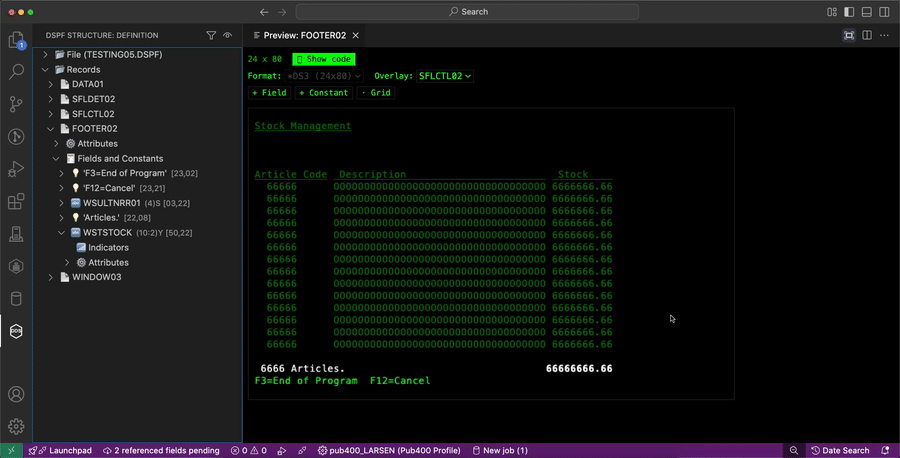

# DSPF-edit

**DSPF-edit** turns DDS display-file editing into a visual, live experience right inside VS Code — see the screen you're building as you build it, instead of guessing until you compile.

> 📖 **[Read the full manual →](https://christianlarsen.github.io/dspf-edit/)** — step-by-step guides for every feature, from your first field to windows, subfiles, and indicator conditions.

---

## Why DSPF-edit?

| | SEU / STRSDA (5250) | RDi | DSPF-edit |
|---|:---:|:---:|:---:|
| Live visual preview while you edit | ❌ | ⚠️ separate tool/step | ✅ inline, drag to reposition |
| Auto-updating structure/schema view | ❌ | ✅ | ✅ |
| Runs inside VS Code | ❌ | ❌ (Eclipse) | ✅ |
| Simulate indicators/colors without compiling | ❌ | ❌ | ✅ |
| Multiple `DSPSIZ` formats (`*DS3`/`*DS4`) resolved side by side | ❌ | ⚠️ manual | ✅ |
| AND/OR indicator conditions (up to DDS's 9-indicator limit) built visually | ❌ | ⚠️ manual | ✅ |

DSPF-edit doesn't replace your compiler — it closes the gap between writing DDS and seeing the screen it produces, matching real **STRSDA** behavior field by field, so what you preview is what you get.

---

## ✨ Features

### 🖥️ Screen Preview — see it before you compile
  - Visual, green-screen-style preview of a record's fields and constants (colors, DSPATR attributes, and placeholders for output/input/both fields).
  - A field coded with `CNTFLD(n)` wraps across multiple lines in the preview, `n` characters each, all starting at its original column — matching how RDi previews it.
  - A single, compact toolbar (size, display format, overlay, indicators, add buttons) sits above the preview.
  - Drag fields/constants to reposition them directly on the preview.
  - "+ Field" / "+ Constant" buttons: click, then click a point on the screen to place a new field/constant there, using the same prompts as the tree's "Add field"/"Add constant" commands.
  - WINDOW records are drawn at their real screen position and can be resized/moved with the mouse; shows WDWTITLE if present. Supports windows shared via WINDOW(record-name).
  - Click a window's title to edit it, or use its "⋮" actions menu / one-click "center horizontally" icon — all shown only while hovering over the window.
  - Subfile (SFL/SFLCTL) records show all SFLPAG rows, together with their paired header/detail record; detail rows can't be dragged up over the header's own content.
  - Overlay any number of other records (dimmed) behind the one being previewed, picked from a checkbox list, to see how they compose. A subfile's header and detail always come together, and the record named in `WINDOW(record-name)` is always shown. Both that pairing and keeping the checked overlays when switching records can be turned off from the "⚙ Configuration" panel.
  - Simulate indicators on/off to preview conditional fields, constants, and attributes.
  - A function-key legend (`F3`, `F12`, ...) shows every command key available to the record being previewed (file-level + record-level CAxx/CFxx); a key still shows even when its indicator condition isn't currently met (so you can see it's defined), switching to solid/inverted styling when it's actually active.
  - An active `ERRMSG()` on a window shows on the window's own reserved message line (its last content row) when the window doesn't specify `*NOMSGLIN`, matching real DDS behavior, instead of always at the bottom of the physical screen.
  - A subfile's `SFLMSG()` also shows on the message line when its indicator is active and `SFLDSP` is in effect, the same way `ERRMSG()` does (which still takes priority over it, matching the DDS reference).
  - For files with more than one DSPSIZ format (e.g. *DS3/*DS4), switch which one is previewed — window positions/sizes and conditioned elements are resolved for the selected format. Dragging/resizing/centering a window, or adjusting a subfile's SFLPAG/SFLSIZ, only affects the size currently being previewed.
  - The "Indicators" toggle and the selected display format persist when switching which record is previewed in the same panel.
  - Stays in sync with the schema tree selection in both directions.
  - "Focus" maximizes the preview so it fills the editing area, hiding the DDS source editor beside it; "Show code" brings the source back.
  - Select a field or constant (or several, with Ctrl/Cmd+click) to get a "⋮ Actions" menu: add color/attribute, copy, or delete — applied to every selected element at once for a multi-selection. A single selected field or constant also gets Rename.../Edit Text..., Indicators..., and — for fields — Validity Checks..., Editing Keywords..., and Error Messages..., the same commands the tree's context menu offers, so most of what you'd do from the tree is also reachable straight from the preview.
  - Press `Delete`/`Backspace` with one or more fields/constants selected to delete them directly — same confirmation as the "⋮ Actions" menu's Delete.
  - Double-click a dimmed overlay record (a checked overlay, an SFL/SFLCTL header/detail, or a shared window's owner) to switch the preview to it, the same as picking it in the tree. Where several overlap, the one drawn on top wins.
  - Right-click a field or constant to open the "⋮ Actions" menu directly, instead of the browser's native Cut/Copy/Paste menu — selecting it first if it wasn't already selected.
  - The decimal point and thousands-separator convention used to preview `EDTCDE()`-edited numeric fields — US or European — is configurable from the "⚙ Configuration" panel, either picked manually or fetched with one click from the connected IBM i's `QDECFMT` system value.

### 📏 Column ruler
  - While editing the source by hand, shows the DDS format line (`.....AAN01N02N03T.Name++++++RLen++TDpBLinPos...`) above the line being edited and outlines each column area, so a value in the wrong columns stands out. Hover an area to see its name.
  - Off by default: `Shift+F4` or the "⚙ Configuration" panel turns it on and off.

### 🧭 Schema navigation
  - Two levels are shown: **File** and **Records**.
  - Click on schema elements to jump directly to their location in the source.
  - Right-click for context-aware actions.

### File level
  - View display file attributes (e.g., display size, command keys).
  - Right-click options:
    - Create new records.
    - Assign command keys — a key number already used at the other level (file vs. record) is excluded, so you can't end up with the same key defined as both CA and CF.
    - Add Display Size: adds a second standard screen size (*DS3/*DS4) to a file that currently declares only one.
    - Change Input Default: manages a parameterless `CHGINPDFT` — removes the automatic underline input-capable fields otherwise get by default.
    - Reference File: adds, changes or removes the file-level `REF`, the database file referenced fields take their definition from when their own `REFFLD()` names no file.

### Records level
  - Right-click options:
    - Create new records.
  - Each record shows:
    - Record-level attributes.
    - Constants and fields.
  - Right-click options on a record:
    - Add constant.
    - Add field.
    - Remove field.
    - Copy/Delete record.
    - Add "buttons" (constants for record commands).
    - Assign command keys — a key number already used at the other level (file vs. record) is excluded, so you can't end up with the same key defined as both CA and CF.
    - Add / Remove / Change indicators.
    - Change Input Default: manages a parameterless `CHGINPDFT` for this record — removes the automatic underline input-capable fields otherwise get by default. Warns if the file already has one at file level.
    - Resizing (if window record) — aware of every declared display size, resizing all of them at once.
    - Change Window Title (if window record) — targets the size being worked on when the record declares more than one.
    - Sort elements.
    - Preview Screen Layout (also available as an inline button on the record).

### Constants
  - Show text, position (row/column), indicators, and attributes.
  - Right-click options:
    - Edit constant.
    - Copy constant (to the same or different record).
    - Remove constant.
    - Center constant on screen.
    - Change position (absolute position/relative to existing constant).
    - Apply colors/attributes.
    - Add / Remove / Change indicators, including more than 3 ANDed indicators (up to DDS's limit of 9, spilling onto continuation lines automatically) and OR'd conditions (add/remove whole OR'd groups, or edit indicators within one).
    - Fill constant with characters.

### Fields
  - Show name, length, type, position (row/column), and flags (referenced/hidden).
  - Indicators and attributes are expandable; an OR'd condition is grouped into its ANDed sub-conditions ("Group 1 (AND)" / "OR" / "Group 2 (AND)" / ...) instead of one flat list. Hovering a conditioned field/constant/attribute shows the full condition (e.g. `51 AND NOT 61 AND 53  OR  52`) as a tooltip.
  - Right-click options:
    - Edit field — name, size, and kind (alphanumeric ↔ numeric); switching kind offers to remove any keyword that no longer applies (e.g. `EDTCDE`/`EDTWRD` when going alphanumeric).
    - Copy field (to the same or different record).
    - Remove field.
    - Center field on screen.
    - Change position (absolute position/relative to existing constant/field).
    - Apply colors/attributes.
    - Add validity checks.
    - Add editing keywords.
    - Add error messages.
    - Add / Remove / Change indicators, including more than 3 ANDed indicators (up to DDS's limit of 9, spilling onto continuation lines automatically) and OR'd conditions (add/remove whole OR'd groups, or edit indicators within one).
    - Resolve Referenced Field (for referenced fields only): fetches the real type/length/decimals from the connected IBM i, via the [Code for i](https://marketplace.visualstudio.com/items?itemName=HalcyonTechLtd.code-for-ibmi) extension — or, for a field referencing another field of the same source (`*SRC`), straight from the source, with no connection. The field's own length/decimals/type overrides (e.g. `+4`) are applied on top. Also available as "Resolve All Referenced Fields" from the status bar, for every pending referenced field in the document at once.

### Attributes
  - Add / Remove / Change indicators, with the same AND/OR support as fields and constants.
  - Remove attribute.

---

## 🚀 How to Use

1. Open a DDS display file in VS Code.  
2. Go to **explorer view** in VS Code.
3. The **schema view** will appear automatically with the name "DSPF STRUCTURE".  
4. Use **left-click** to navigate, or **right-click** to access contextual options.  

See the **[full manual](https://christianlarsen.github.io/dspf-edit/)** for a guided walkthrough and the complete feature reference.

---

## ⚙️ Requirements

- Visual Studio Code **v1.75** or higher.

---

## 🐞 Known Issues

No known blocking issues right now. Please [open an issue](https://github.com/christianlarsen/dspf-edit/issues) if something isn't working as expected!

---

## 📝 To Do

- Bug fixes.  
- Support removing a declared display size.  
- Many new features to come!  

---

## 📦 Version History
See the full changelog [here](./CHANGELOG.md).

### Latest
**1.10.0** - 2026-09-30
- Added: Screen Preview overlays several records at once ([#89](https://github.com/christianlarsen/dspf-edit/discussions/89)), picked from a checkbox list with a filter for long files. Checked overlays stay checked when switching records in the same file.
- Added: a subfile's header and detail now appear checked in the Overlay list and always go together, also when checked as an overlay. The record named in `WINDOW(record-name)` is always shown.
- Added: **Preview Overlay** settings in the Configuration panel to turn off the subfile pairing and keeping overlays when switching records.
- Added: a column ruler above the line being edited, like vscode-rpgle's for fixed-format RPG ([#94](https://github.com/christianlarsen/dspf-edit/issues/94)). Off by default; `Shift+F4` or the Configuration panel turns it on.
- Added: the Screen Preview shows a warning icon (⚠) while referenced fields are still waiting to be resolved.
- Fixed: a field or constant positioned with `+n` after a referenced field now counts from the end of that field, using its real length once resolved ([#97](https://github.com/christianlarsen/dspf-edit/issues/97)).
- Changed: double-clicking overlapping overlays switches to the one drawn on top.
- Changed: resolved referenced fields show in their normal color; the orange marker is only for fields still waiting to be resolved.

---

## ⭐ Enjoying DSPF-edit?

If it's saving you trips to SEU or STRSDA, please consider [leaving a rating on the Marketplace](https://marketplace.visualstudio.com/items?itemName=ChristianLarsen.dspf-edit&ssr=false#review-details) — it takes 10 seconds and is the single biggest thing that helps other IBM i developers find it.

💬 **Feedback is welcome!** Please leave a comment, [open an issue](https://github.com/christianlarsen/dspf-edit/issues), and enjoy using DSPF-edit.
